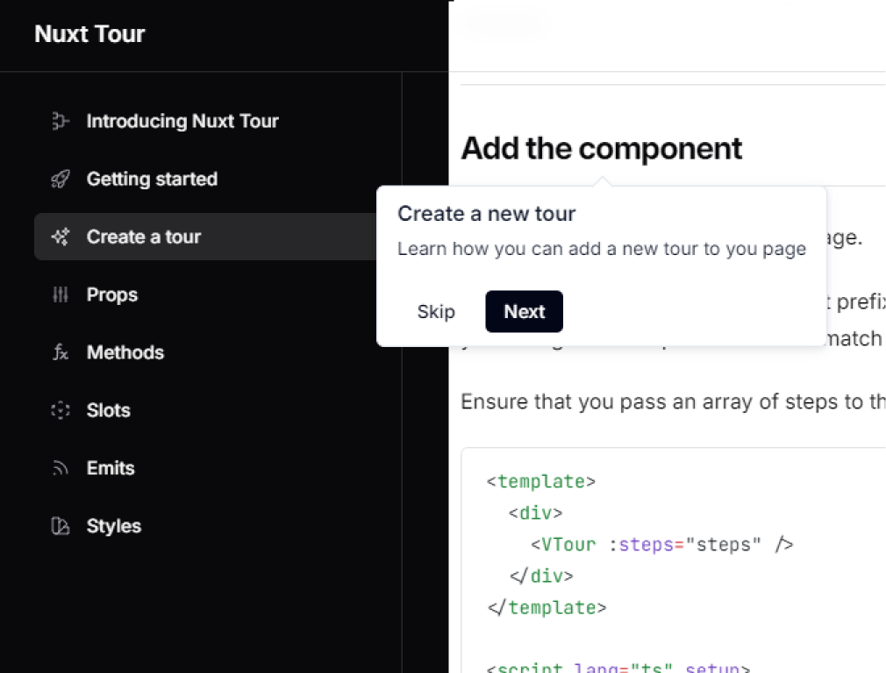

# Nuxt Tour

[![npm version][npm-version-src]][npm-version-href]
[![npm downloads][npm-downloads-src]][npm-downloads-href]
[![License][license-src]][license-href]
[![Nuxt][nuxt-src]][nuxt-href]



<br/>

Add interactive guided tours to your Nuxt app. nuxt-tour gives you a fully-featured `<VTour />` component and a `useTour()` composable so you can drive tours from anywhere in your code.

- [📖 &nbsp;Documentation](https://nuxt-tour.behonbaker.com/)
- [✨ &nbsp;Release Notes](/CHANGELOG.md)
- [🤝 &nbsp;Contributing](/CONTRIBUTING.md)

## Features

- **Component + Composable** — use `<VTour />` declaratively or control tours programmatically with `useTour()`
- **Smart localStorage** — three storage modes: `'end'` (default), `'step'` (resume mid-tour), or `'never'`; supports TTL expiry and version-based resets
- **Keyboard navigation** — arrow keys to move between steps, Escape to exit
- **Highlight & backdrop** — spotlight the target element with an outline and an optional dark overlay
- **Fully customisable** — every piece of the tooltip is a named slot; styling is done with CSS custom properties (`--nt-*`), no Sass required
- **SSR safe** — all browser APIs are guarded behind `import.meta.client`
- **Accessible** — focus trap, scroll lock, and `role="tooltip"` out of the box

## Quick Setup

```bash
# npm
npm install nuxt-tour

# bun
bun add nuxt-tour
```

Add the module to your `nuxt.config`:

```ts
export default defineNuxtConfig({
  modules: ["nuxt-tour"],
});
```

## Basic Usage

Define your steps and drop in the component:

```vue
<template>
  <div>
    <h1 class="hero-title">Welcome</h1>
    <button class="cta">Get started</button>

    <VTour :steps="steps" auto-start />
  </div>
</template>

<script setup lang="ts">
import type { TourStep } from "#nuxt-tour/types";

const steps: TourStep[] = [
  {
    target: ".hero-title",
    title: "Welcome to the app",
    body: "This is your dashboard. Let us show you around.",
  },
  {
    target: ".cta",
    title: "Ready to go?",
    body: "Click here whenever you want to get started.",
  },
];
</script>
```

## Composable Usage

Control a tour from anywhere — even before the component mounts:

```ts
const { isPlayed, start, reset, currentStep, isActive } = useTour("onboarding");

// Show a "Replay tour" button only after the tour has been completed
if (!isPlayed.value) {
  await start();
}
```

## Module Options

```ts
export default defineNuxtConfig({
  modules: ["nuxt-tour"],
  tour: {
    // Component name prefix. Default "V" → <VTour />
    prefix: "V",

    // Inject the default stylesheet. Set false to bring your own.
    injectCSS: true,

    // localStorage key prefix. Default "nt" → key "nt-onboarding"
    storagePrefix: "nt",

    // Bump this string to force all previously-played tours to show again.
    storageVersion: "v2",
  },
});
```

## Key Props

| Prop | Type | Default | Description |
|---|---|---|---|
| `steps` | `TourStep[]` | — | Step definitions (required) |
| `name` | `string` | `"default"` | Unique tour name — used as the localStorage key |
| `autoStart` | `boolean` | `false` | Start the tour on mount |
| `saveToLocalStorage` | `'end' \| 'step' \| 'never'` | `'end'` | When to persist progress |
| `ttl` | `number` | — | Days before a completed tour shows again |
| `highlight` | `boolean` | `false` | Outline the target element |
| `backdrop` | `boolean` | `false` | Show a dark overlay |
| `showProgress` | `boolean` | `false` | Show "Step N of M" counter |
| `keyboard` | `boolean` | `true` | Arrow-key and Escape navigation |
| `scrollBehavior` | `'jump' \| 'smooth' \| 'none'` | `'jump'` | How to scroll to each step |
| `trapFocus` | `boolean` | `true` | Trap keyboard focus inside the tooltip |
| `lockScroll` | `boolean` | `true` | Prevent page scrolling while the tour is active |

## Customising Styles

Override any `--nt-*` CSS custom property on `#nt-tooltip`:

```css
#nt-tooltip {
  --nt-bg: #1e1e2e;
  --nt-text: #cdd6f4;
  --nt-border-color: #45475a;
  --nt-btn-bg: #cba6f7;
  --nt-btn-color: #1e1e2e;
  --nt-radius: 10px;
}
```

## Emits

| Event | Payload | Description |
|---|---|---|
| `tour:start` | — | Tour has begun |
| `tour:end` | — | Tour completed |
| `tour:skip` | — | Tour was skipped |
| `tour:step-change` | `{ from, to }` | Step changed |

## Exposed Methods

```ts
const tour = useTemplateRef("tour");

tour.value?.startTour();
tour.value?.endTour();
tour.value?.skipTour();
tour.value?.nextStep();
tour.value?.prevStep();
tour.value?.goToStep(2);
tour.value?.pause();
tour.value?.resume();
tour.value?.resetTour();
```

## Contributing

See [CONTRIBUTING.md](/CONTRIBUTING.md) for local dev setup, coding standards, and the PR checklist.

<!-- Badges -->

[npm-version-src]: https://img.shields.io/npm/v/nuxt-tour/latest.svg?style=flat&colorA=020420&colorB=00DC82
[npm-version-href]: https://npmjs.com/package/nuxt-tour
[npm-downloads-src]: https://img.shields.io/npm/dm/nuxt-tour.svg?style=flat&colorA=020420&colorB=00DC82
[npm-downloads-href]: https://npmjs.com/package/nuxt-tour
[license-src]: https://img.shields.io/npm/l/nuxt-tour.svg?style=flat&colorA=020420&colorB=00DC82
[license-href]: https://npmjs.com/package/nuxt-tour
[nuxt-src]: https://img.shields.io/badge/Nuxt-020420?logo=nuxt.js
[nuxt-href]: https://nuxt.com
